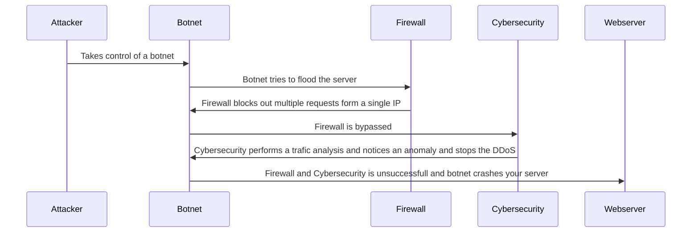

## Definitions
- Attacker: a cybercriminal wanting to crash your server
- Botnet: a group of computers and systems the attacker has gained control of and will do actions on his behalf
- firewall: a security device used to protect servers and networks by filtering out unapproved IP addresses
- Cybersecurity: a professional in charge of protecting networks from cybercriminals
- Webserver: A computer-like device that stores your website and files so others can access them

## Sequence of attack
1. The attacker gains control of many computers or bots usually by installing a virus these computers are like zombies and act normally until they are called upon.
2. When the attacker is ready he controls his network of bots to begin sending multiple requests to a single network, this will overload the network and cause it to crash.
3. Luckily the Webserver has a firewall that is set up to limit the amount of requests coming from one IP address.
4. The firewall helps but since there are far too many bots, this will not end the DDoS attack
5. The botnet gets past the firewall and the next defense would be the Cybersecurity professionals.
6. They perform a series of traffic analyses to determine anomalies.
7. Anomalies could be anything that is out of the normal like multiple requests coming from a single IP or multiple users all sending the same requests at the same time.
8. The cybersecurity professionals can end the attack but if they were to miss this attack then the requests would get to the web server and crash it.
